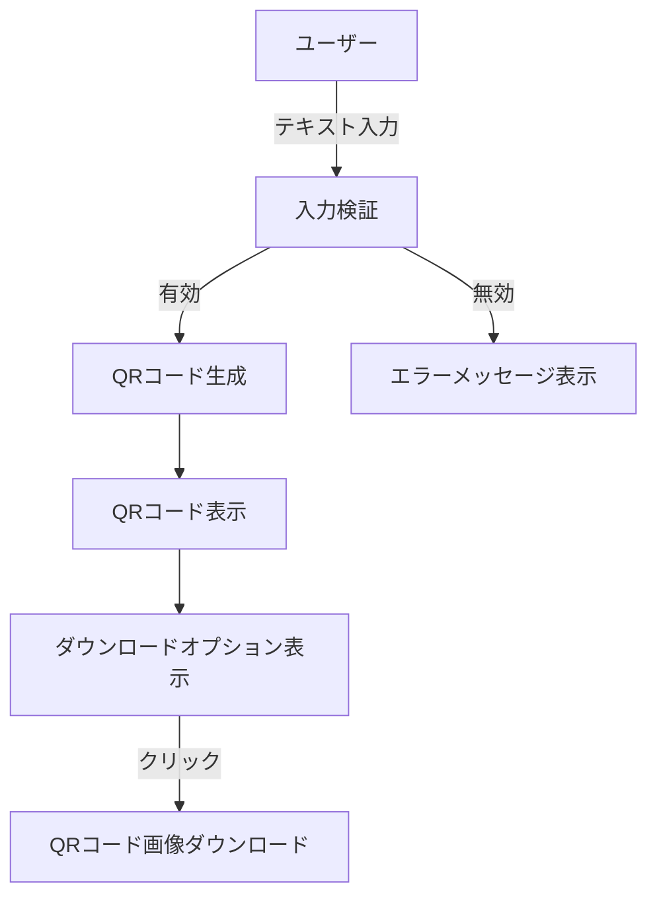

# デザインドキュメント

## 概要

このドキュメントでは、QRコード生成Webアプリケーションの設計について詳細に説明します。このアプリケーションは、ユーザーがテキストを入力し、対応するQRコードを生成、表示、ダウンロードできるシンプルなWebインターフェースを提供します。

## アーキテクチャ

アプリケーションはクライアントサイドのみで動作するシンプルなシングルページアプリケーション（SPA）として設計します。これにより、サーバーサイドの複雑さを排除し、デプロイと保守を容易にします。

### 技術スタック

- **フロントエンド**: HTML5, CSS3, JavaScript (ES6+)
- **QRコード生成**: qrcode.js ライブラリ
- **スタイリング**: CSS フレームワーク（Bootstrap または Tailwind CSS）
- **レスポンシブデザイン**: メディアクエリとフレキシブルレイアウト

### システムフロー



## コンポーネントとインターフェース

### UIコンポーネント

1. **ヘッダーセクション**
   - アプリケーションタイトル
   - 簡単な説明文

2. **入力セクション**
   - テキスト入力フィールド
   - QRコード生成ボタン
   - 入力検証フィードバック

3. **出力セクション**
   - QRコード表示エリア
   - ダウンロードボタン
   - ローディングインジケーター

4. **フッターセクション**
   - クレジット情報
   - 使用方法のヒント

### ユーザーインターフェースモックアップ

```
+-----------------------------------------------+
|                QRコード生成ツール              |
|  簡単にQRコードを作成してダウンロードできます  |
+-----------------------------------------------+
|                                               |
| テキストを入力:                               |
| +-----------------------------------+         |
| |                                   |         |
| +-----------------------------------+         |
|                                               |
| [QRコード生成]                                |
|                                               |
+-----------------------------------------------+
|                                               |
|              QRコード表示エリア               |
|                                               |
|                                               |
|                                               |
|                                               |
|                                               |
|                                               |
|                                               |
|                                               |
|                                               |
|                                               |
|                                               |
|                                               |
|                                               |
|                                               |
|                                               |
|                                               |
|                                               |
|                                               |
|                                               |
|                                               |
|                                               |
|                                               |
|                                               |
|                                               |
|                                               |
|                                               |
|                                               |
|                                               |
|                                               |
|                                               |
|                                               |
|                [ダウンロード]                 |
|                                               |
+-----------------------------------------------+
|  © 2025 QRコード生成ツール                    |
+-----------------------------------------------+
```

## データモデル

このアプリケーションは主にクライアントサイドで動作し、永続的なデータストレージを必要としません。ただし、以下のデータ構造を使用します：

### QRコードデータ

```javascript
{
  inputText: string,    // ユーザーが入力したテキスト
  qrCodeImage: string,  // 生成されたQRコードの画像データ（Base64エンコード）
  timestamp: Date,      // 生成時のタイムスタンプ
  dimensions: {         // QRコードの寸法
    width: number,
    height: number
  }
}
```

## エラーハンドリング

### 想定されるエラー

1. **入力検証エラー**
   - 空の入力
   - 過度に長いテキスト入力
   - 処理できない特殊文字

2. **QRコード生成エラー**
   - ライブラリの内部エラー
   - ブラウザの互換性の問題

3. **ダウンロードエラー**
   - ブラウザのダウンロード機能の制限
   - ファイルシステムのアクセス権限の問題

### エラーハンドリング戦略

- 入力フィールドの下に明確なエラーメッセージを表示
- 入力検証はリアルタイムで行い、即時フィードバックを提供
- エラーが発生した場合、ユーザーに具体的な問題と可能な解決策を提示
- すべてのエラーメッセージは技術的な詳細を避け、ユーザーフレンドリーな言葉で表現

## テスト戦略

### 単体テスト

- 入力検証ロジックのテスト
- QRコード生成機能のテスト
- ダウンロード機能のテスト

### 統合テスト

- ユーザー入力からQRコード生成までの全体フローのテスト
- エラーハンドリングのテスト
- レスポンシブデザインのテスト

### クロスブラウザテスト

- 主要ブラウザ（Chrome、Firefox、Safari、Edge）での動作確認
- モバイルブラウザ（iOS Safari、Android Chrome）での動作確認

### ユーザビリティテスト

- 直感的な操作が可能かの確認
- エラーメッセージの分かりやすさの確認
- モバイルデバイスでの使いやすさの確認

## パフォーマンス考慮事項

- QRコード生成はクライアントサイドで行い、サーバーへの不要なリクエストを避ける
- 画像生成とダウンロードは非同期で処理し、UIのブロックを防ぐ
- 最小限のライブラリ依存関係を維持し、初期ロード時間を最適化
- 画像のキャッシュを活用して、同じ入力に対する再生成を避ける